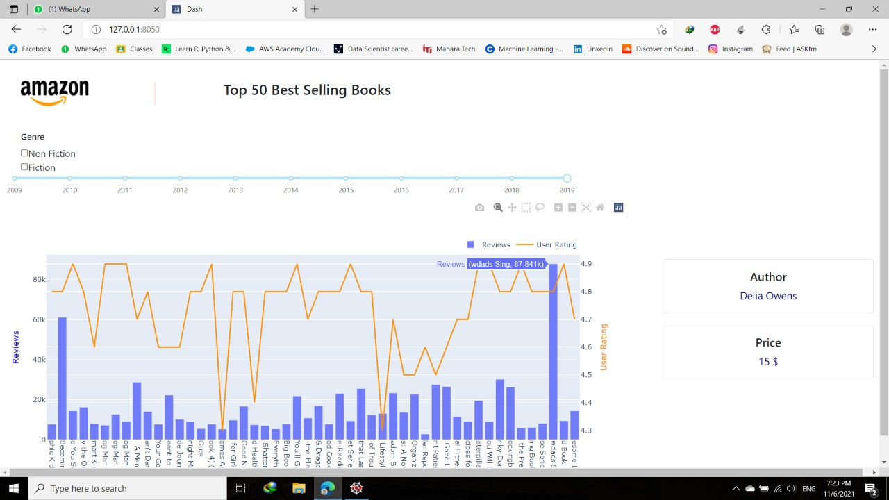

# Top-50-best-selling-books-on-amazon.
It's a dashboard that shows the detailed information about each book in the top 50 best selling books on amazon over the last ten years
## Table of contents:
### 1-General info
### 2-Setup
## General info
In this project,we implement a dashboard that shows the detailed information about each book in the top 50 best selling books on amazon over the last ten years. 
when the user clicks on a book in the graph , all the information about it appear.
## Setup
To run this project, install :
1- dash library
2- plotly.express library
3- plotly.graph_objects library
4- dash_bootstrap_components library
5- numpy library
6- pandas library

     

